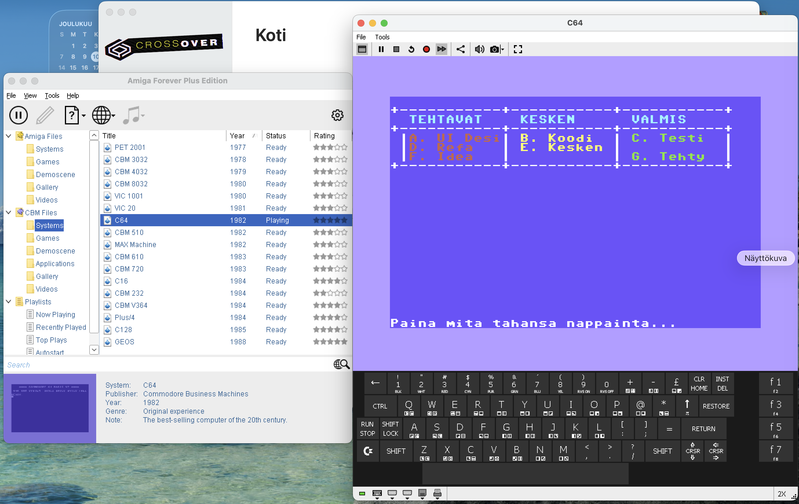

## C64 kanban

- [X] Made with C89
- [X] ./build.sh at Linux or macOS
- [X] build.bat at Windows
- [X] Colored lists and cards
- [ ] Swimlanes
- [ ] Add card
- [ ] Open card by typing character or number
- [ ] Save card
- [ ] Load List and cards at startup

## Screenshot

