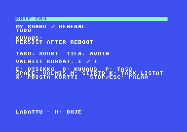
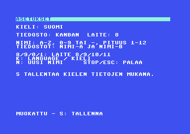

# C64 Kanban

A working, keyboard-controlled kanban application for a stock Commodore 64.
Written in C89 and compiled with cc65. The native terminal version runs the same
UI, data model and file format.



## Features

- Create, rename, select and delete **boards, swimlanes and lists**.
- New boards start with a GENERAL swimlane and TODO, DOING and DONE lists.
- Create and edit **cards**, including a title, description, priority and done flag.
- Move cards to another list, swimlane or board, and reorder cards within a cell.
- Multiple named **checklists per card**, with editable, removable items and checkboxes.
- Checklist progress appears on the board and card detail screen.
- Collections scroll beyond the visible page; all allocated entries are accessible.
- Confirmation before deletion, discarding edits, or replacing unsaved data.
- **Load and save all boards through C64 KERNAL/IEC disk I/O**.
- Two alternating SEQ snapshots, versioned format, CRC-16, relationship validation,
  and read-back verification. A failed write preserves the other snapshot.
- Automatic startup load from device 8; configurable data name and devices 8–11.
- English and Finnish UI, with the language saved alongside the project data.

## Run on a Commodore 64

Transfer `kanban.prg` to a writable disk or build a D64 with `make disk`.
The resulting `build/c64kanban.d64` contains the program and room for data.
On the C64:

```basic
LOAD"KANBAN",8,1
RUN
```

The initial load looks for `KANBAN-A` and `KANBAN-B` on device 8. On a new disk,
`NO SAVED DATA` is normal: start editing the empty MY BOARD and press **S** to save.
With no drive available, the application still starts and can be used in RAM.

A 1541 disk drive is supported through standard KERNAL operations. IEC-compatible
storage such as an SD2IEC is an intended target, but has not been tested on physical
hardware. **Datasette/tape, REU, cartridge flash, and direct SD-card access are not
implemented.** In VICE, attach a writable D64 to unit 8. Data goes into that image.

## Language

Press **F** for settings, then **K** to switch between **ENGLISH** and **SUOMI**.
The settings screen changes language immediately. Press **RUN-STOP** (host: Esc)
to return to the board, then **S** to save the selection with all project data.
Startup and manual load restore the language of the selected snapshot. A new
project and a legacy version-1 snapshot default to English.

**Finnish UI:** Open settings with **F**, then press **K** to select **SUOMI**.
Return to the board with **RUN-STOP** (Esc on a computer) and save with **S**.
The selection is restored on the next load. Use the same steps to switch back
to English. Shortcuts are the same in both languages: N = new, E = edit,
X = delete, S = save and L = load.

The translation covers menus, prompts, help and error messages. Board/card titles
and descriptions are user content and are not translated when switching language.
Finnish wording fits the stock C64 uppercase character set without a custom font.



## Controls

| View | Key | Action |
| --- | --- | --- |
| Board | Cursor left/right | Select list; scroll through groups of three |
| Board | Cursor up/down | Select card; scroll through pages of five |
| Board | RETURN or 1–5 | Open selected card or numbered card in active list |
| Board | N | New card in the selected swimlane/list |
| Board | + / - | Move selected card down/up in its cell |
| Board | B / U / T | Manage boards / swimlanes / lists |
| Board | S / L | Save / load the complete collection of boards |
| Board | F | Settings: language, data filename and drive |
| Board | H / Q | Help / quit (with unsaved-change choices) |
| Manager | Up/down, RETURN | Select and open an entry |
| Manager | N / E / X | New / rename / delete an entry and its contents |
| Card | E / D / P | Edit title / description / cycle priority |
| Card | SPACE | Toggle card done/open |
| Card | M / K / X | Move / manage checklists / delete card |
| Checklist items | SPACE or RETURN | Toggle selected checkbox |
| Checklist items | N / E / X | New / edit / delete item |
| Editor | DEL, SHIFT+CLR/HOME | Backspace, clear the input |
| Editor | RETURN / RUN-STOP | Accept / cancel without changing the entry |
| Dialogs | RUN-STOP | Return to the previous view |

On the host, **Esc** corresponds to RUN-STOP and **Ctrl-U** clears input.
Titles accept 24 uppercase characters; descriptions accept 60. The board truncates
long titles to fit the columns; open the card or manager to read the full title.
Text entry uses an uppercase ASCII/PETSCII-compatible subset (bytes 32–95), with
letters, digits and punctuation. Unicode and accented letters are not supported.

Deleting a board, swimlane, list or card also deletes its contents. The last board,
and the last swimlane/list on each board, cannot be deleted. Marking a card done is
independent of its list name and checklist state; moving into DONE does not
implicitly tick checkboxes.

## Storage and recovery

**S saves every board**, not just the one on screen. The `*` beside the board name
means there are changes in RAM that have not been saved successfully.

The default files are `KANBAN-A` and `KANBAN-B`, both Commodore SEQ files. Each save
writes the older/invalid slot, closes it, then reads it back and verifies its
contents. The other successfully written snapshot remains untouched. On load,
the newest valid generation wins; a corrupt or truncated newer copy falls back
to the older one. If neither is usable, RAM data remains unchanged.

Keep both files together when backing up or transferring a project. Neither file
should be opened with BASIC `LOAD`: these are data, not programs. The application
uses no save-and-replace `@:` operation. Interrupted writes can leave a splat file
in the attempted slot; the next save scratches that slot before retrying. For
filesystem repair, make a disk-image backup before using drive maintenance tools.

The F menu selects device 8, 9, 10 or 11 with **8, 9, 0 or 1**. Press **N** to change
the base name (1–12 characters, A–Z, 0–9 or `-`). Press K to switch language.
The settings stay open until RUN-STOP/Esc.
Filename and device settings last for the current session; startup always uses
KANBAN/device 8. The language is saved with the project and restored on load.
Choose F and then L to open a differently named saved project. Loading while `*`
is visible asks before replacing edits.

New saves use format version 2 to include the language. This version reads the
previous version-1 files; the original application cannot read version-2 saves.

Each snapshot occupies 7,376 bytes (30 blocks on a 1541 disk); allow 60 blocks for
the pair. Disk errors and failed verification do not clear the unsaved marker.
Power loss while writing the drive's directory/BAM is outside application-level
recovery guarantees; keep a separate backup of important projects.

## Capacity on a stock C64

The following fixed pools are shared across all boards, not reserved per board.
Deleting entries makes their slots reusable.

| Entity | Maximum |
| --- | ---: |
| Boards | 4 |
| Swimlanes | 12 |
| Lists | 16 |
| Cards | 40 |
| Named checklists | 20 |
| Checklist items | 80 |

A new board needs one free swimlane and three free lists in addition to its own
slot. If any pool is full, creation fails without a partial object. Each in-memory
snapshot is 7,364 bytes. The program keeps a second one to validate loads before
committing them. No expansion RAM or dynamic heap allocation is required by the
application. `tools/check_memory.py` checks the cc65 map for at least 4 KiB between
static data and the top of the C stack.

## Build

Install **cc65** (tested with the Ubuntu cc65 2.19 package and development build
`e11fb5c`) and **make**. The build scripts do not install packages automatically.

```sh
./build.sh                 # C64 kanban.prg
make disk                  # build/c64kanban.d64; requires VICE c1541
./linux/build-linux.sh     # build/kanban-host (Linux/macOS terminal)
./build/kanban-host
```

On Windows, install cc65, add its `bin` directory to PATH, and run `build.bat`.
Use a terminal at least 40 columns by 25 rows for the host version. Host saves use
the same uppercase base names in the current working directory; the device setting
has no effect there. Use a separate directory for each independent host session.

## Tests

```sh
make test host all
python3 tools/check_memory.py
make -B test CFLAGS='-std=c89 -pedantic -Wall -Wextra -Werror -g -fsanitize=address,undefined -fno-omit-frame-pointer'
python3 tests/vice_smoke.py   # VICE x64sc/c1541, installed ROMs and DISPLAY required
make check-snapshot         # read back its C64-produced files on the host
```

`vice_smoke.py --help` describes optional ROM, system directory and Xvfb paths.
It creates an isolated test D64 under `build/vice-test`, drives the actual PRG,
checks save/read-back, switches to Finnish, performs a cold emulator restart and
verifies the restored language, card, description, priority and checkbox. It then
switches back to English, saves and restarts to check that direction too. It requires real C64/1541 ROM images;
ROMs and emulator binaries are not included in this repository.

Native tests cover data relationships, cascading deletion, capacity exhaustion,
10,000 deterministic mutation operations, UI input and navigation in both languages,
translation widths and placeholder parity, legacy file migration, malformed
snapshots, CRC errors, generation wraparound, and injected disk failures. See
[validation notes](docs/VALIDATION.md) and the [file format](docs/FORMAT.md).

## Development layout

- `kanban.c`: shared UI and application loop.
- `src/model.c`: fixed-capacity kanban model and validation.
- `src/storage.c`: snapshot/recovery protocol, including the saved language.
- `src/strings.def`, `src/i18n.c`: paired English/Finnish UI text and selection.
- `src/disk_c64.c`, `src/platform_c64.c`: C64 drive and screen/keyboard adapters.
- `src/disk_host.c`, `src/platform_host.c`: native file and terminal adapters.
- `tests/`: model, storage, UI and real-machine-emulator regression tests.

[Roadmap](ROADMAP.md) · [MIT license](LICENSE)
